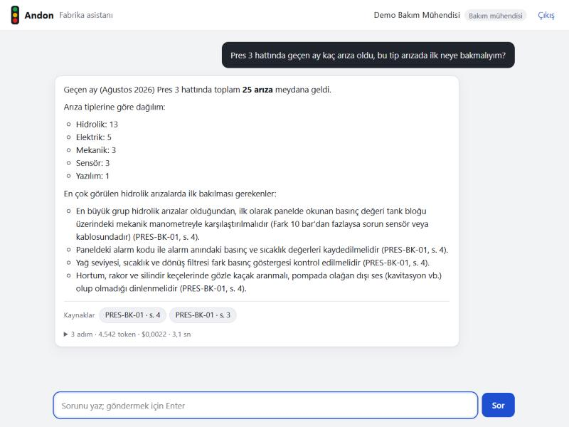
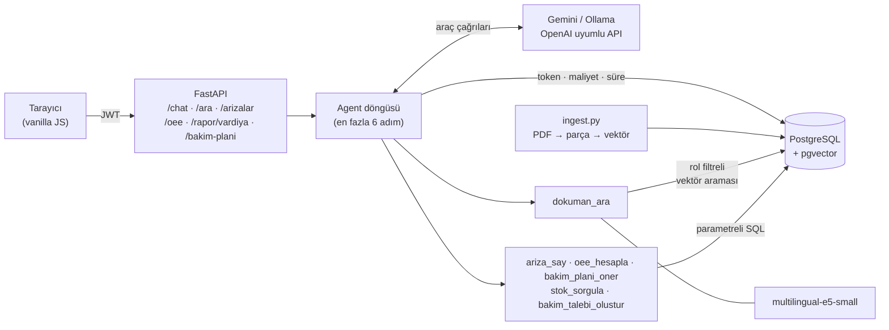

# Hata Asistanı

Fabrika verisi ve bakım kılavuzları üzerinde çalışan bir yapay zekâ asistanı. Operatör ya da bakım
mühendisi sohbet ekranına şöyle bir soru yazar:

> Pres 3 hattında geçen ay kaç arıza oldu, bu tip arızada ilk neye bakmalıyım?

Asistan sorunun ilk yarısını veritabanında sayarak, ikinci yarısını bakım kılavuzlarında arayarak
cevaplar ve kılavuzdan aldığı her bilginin kaynağını sayfa numarasıyla gösterir:



*Gerçek çıktı: `gemini-3.5-flash-lite`, 3 adım, 3,1 saniye, $0,0022. Sayılar veritabanıyla birebir
aynı (25 arıza, 13 hidrolik).*

Kaynağa tıklayınca kılavuzun PDF'i o sayfada açılır. Operatör yalnızca operasyon dokümanlarını,
bakım mühendisi bütün kılavuzları görür.

**OEE paneli** hatların vardiya verisinden OEE'yi (kullanılabilirlik × performans × kalite),
günlük seyrini, duruş nedenlerinin Pareto'sunu ve hattı en uzun durduran makineleri gösterir.
Renkler andon ışıklarıyla aynıdır: %85 ve üstü yeşil (dünya standardı), %65–85 sarı, altı
kırmızı. Andon yeşili ile kırmızısı kırmızı-yeşil renk körlüğünde neredeyse aynı göründüğü için
(ölçülen OKLab farkı 5, gereken en az 8) durum hiçbir yerde yalnızca renkle verilmez: her
seviyenin bir şekli ve adı var (● iyi, ◆ orta, ▼ düşük). Günlük grafiğin değerleri fareyle,
dokunarak ve ok tuşlarıyla okunur, ayrıca tablo olarak açılır. Seçili hat ve dönem adreste
tutulur (`#oee?hat=Pres+3&donem=7`), bağlantı paylaşılınca aynı görünüm açılır. "Asistana sor"
düğmesi paneldeki hat ve tarih aralığıyla asistana "OEE neden bu seviyede?" diye sorar;
asistan aynı sayıları `oee_hesapla` aracından alır.

**Vardiya raporu** bir vardiyanın OEE'sini, en uzun duruşlarını, vardiyada başlayan arızaları,
açık bakım taleplerini ve kritik stoğu tek sayfada toplar; asistan da bunlardan kısa bir özet ve
öneriler yazar. Rapor kopyalanıp mesaja yapıştırılabilir ya da yazdırılabilir. Sayıların hepsi
veritabanından gelir; asistanın yazdığı yorumdaki her sayı bu verilerle karşılaştırılır.

**Bakım planı** (yalnızca bakım rolü) her makinenin önümüzdeki günlerde arıza olasılığını son
90 günün arızalarından tahmin eder ve ekibin sınırlı saatini, beklenen hat duruşunu en çok
azaltacak makinelere dağıtır. Şu an arızalı olan makine de "tamirden sonra" notuyla plana girer.

**Telegram botu** (isteğe bağlı) hat durduğunda bakım ekibine kılavuzdaki ilk adım ve yedek
parça durumuyla anında bildirim gönderir; sahadan soru sormayı ve fotoğrafla bakım talebi
açmayı sağlar. Ayrıntılar ve veri gizliliği: [Telegram botu](#telegram-botu).

> **Adı ve ikonu:** Proje, fabrikalarda bir hatta sorun olduğunda yanan yeşil-sarı-kırmızı
> uyarı ışığı sisteminden, *Andon*'dan esinlendi; arayüzdeki ışık kulesi ve panel renkleri
> buradan geliyor. Kod deposunun adı bu yüzden `andon`.
> **Bu projedeki bütün veriler ve kılavuzlar kurgusaldır**; gerçek bir firmaya veya ekipmana ait
> değildir.

## Nasıl çalışıyor

1. Kullanıcı soruyu yazar; istek JWT ile FastAPI'ye gelir.
2. API soruyu LLM'e, kullanabileceği araçların listesiyle birlikte gönderir.
3. LLM sorunun iki parçalı olduğunu anlar ve `ariza_say(hat="Pres 3", baslangic="2026-08-01",
   bitis="2026-08-31")` ile `dokuman_ara("hidrolik arızada ilk kontrol")` araçlarını çağırır.
4. İlk araç parametreli bir SQL sorgusu çalıştırır. İkincisi soruyu vektöre çevirir ve pgvector'da,
   yalnızca kullanıcının rolünün görebildiği kılavuzlarda en yakın parçaları bulur.
5. LLM iki sonucu birleştirip kaynak göstererek cevap verir. İsteğin token'ı, maliyeti ve süresi
   kaydedilir.



## Hızlı başlangıç

Gerekenler: Docker Desktop ve bir Gemini API anahtarı ([Google AI Studio](https://aistudio.google.com/apikey),
ücretsiz katman yeterli).

```bash
cp .env.example .env          # sonra .env'deki GEMINI_API_KEY satırını doldur
docker compose up --build
```

İlk açılışta veritabanı 6 aylık sahte veriyle doldurulur, kılavuzlar işlenir ve embedding modeli
indirilir (~470 MB, birkaç dakika). Ardından http://localhost:8000 adresinden `operator` ya da
`bakim` kullanıcısıyla giriş yapılır (parola: `.env`'deki `DEMO_PAROLA`). API belgeleri
http://localhost:8000/docs adresindedir.

## Teknolojiler

| Katman | Kullanılan |
|---|---|
| API | Python 3.12, FastAPI, Pydantic |
| Veritabanı | PostgreSQL 17, pgvector, psycopg 3 (bağlantı havuzu) |
| Kılavuz arama | pypdf, sentence-transformers (`intfloat/multilingual-e5-small`) |
| LLM | Gemini (`gemini-3.5-flash-lite`), OpenAI uyumlu uç noktası üzerinden; Ollama isteğe bağlı |
| Güvenlik | JWT (PyJWT), argon2 (pwdlib) |
| Arayüz | HTML, CSS, vanilla JavaScript (dış bağımlılık yok) |
| Telegram | Bot API, httpx ile ince istemci, uzun yoklama (dışarıya açık adres gerekmez) |
| Kalite | pytest (2575 test), Hypothesis, ruff, GitHub Actions |
| Çalıştırma | Docker Compose |

## Telegram botu

| Ne yapar | Nasıl |
|---|---|
| Arıza bildirimi | Hattı durduran yeni bir arıza en geç ~10 saniyede eşleşmiş herkese bildirilir. Bakım rolüne kılavuzdan ilk adım (sayfa numarasıyla) ve ilgili yedek parçaların stoğu gider; operatöre yalnızca hattın durduğu. |
| Sahadan soru | Yazılan her mesaj web arayüzündeki agent'a, kullanıcının kendi rolüyle gider. |
| Fotoğraflı talep | Fotoğraf + açıklama ("P3-HP'de yağ kaçağı var") ile bakım talebi açılır, fotoğraf talebe eklenir; bakım mühendisi vardiya raporunda görür. |
| Komutlar | `/rapor` son vardiya raporu, `/oee [hat]` son 7 gün, `/plan [saat]` bakım planı (yalnızca bakım), `/gizlilik`, `/cikis`, `/yardim` |

### Kurulum

Token'ı almak dışında her şey hazır. Token almadan önce bütün akış yerelde denenebilir:
`python -m scripts.telegram_prova` botun gerçek kodunu, Telegram'ı taklit eden yerel bir
sunucuya karşı çalıştırır (eşleştirme, soru, fotoğraflı talep, komutlar, arıza bildirimi) ve
bota giden mesajları yazdırır. Gerçek Telegram'a istek gitmez. Token bir paroladır: kimseyle paylaşma, git'e koyma.

1. Telegram'da **@BotFather**'ı aç, `/newbot` yaz. Bota bir ad (ör. *Hata Asistanı*)
   ve sonu `bot` ile biten bir kullanıcı adı (ör. `hata_asistani_bot`) ver. Verdiği token'ı
   kopyala.
2. Aynı sohbette güvenlik için:
   - `/setjoingroups` → botu seç → **Disable** (bot gruplara eklenemesin; bot zaten grupları yok
     sayar ama baştan kapatmak daha iyi).
   - `/setcommands` → botu seç → aşağıdaki listeyi yapıştır:
     ```
     rapor - Son vardiyanın raporu
     oee - Son 7 günün OEE'si (örn. /oee Pres 3)
     plan - Haftalık bakım planı (bakım rolü)
     gizlilik - Neyin saklandığı ve nereye gittiği
     yardim - Komutlar
     cikis - Bu sohbetin bağlantısını kaldırır
     ```
3. `.env` dosyasına ekle:
   ```
   # BotFather'ın verdiği token
   TELEGRAM_BOT_TOKEN=
   TELEGRAM_BOT_KULLANICI_ADI=hata_asistani_bot
   ```
4. Botu başlat:
   ```bash
   docker compose --profile telegram up -d --build    # ya da: python scripts/telegram_bot.py
   ```
5. Web arayüzünde sağ üstteki **Telegram** düğmesi → **Kod al** → "Telegram'da aç" (ya da botta
   `/baglan 123456`). Her kullanıcı kendi hesabını bağlar.
6. Bildirimi denemek için hattı durduran bir arıza ekle:
   ```bash
   python scripts/ariza_ekle.py            # P3-HP, hidrolik, yüksek önem
   python scripts/ariza_ekle.py --bitir 4321   # demodan sonra: betiğin yazdığı numarayla
   ```
   Bitirilmeyen arıza sürüyor sayılır; makine planda ve raporda "şu an arızalı" görünür.

### Veri gizliliği

Teknik önlemler (hepsi testlerle doğrulanır, `tests/test_telegram.py`):

- **Eşleştirme:** Web arayüzünde giriş yapmış kullanıcı 10 dakika geçerli, tek kullanımlık 6
  haneli bir kod alır. Veritabanında kodun kendisi değil SHA-256 özeti tutulur. Yanlış kod
  denemesi sohbet başına 10 dakikada 5 ile sınırlı; iki kullanıcıya aynı kod düşerse ikincisi
  yeniden üretilir (üzerine yazılsaydı bir sohbet başkasının hesabına bağlanabilirdi).
- **Eşleşmemiş sohbet:** Tanıtım mesajından başka hiçbir şey almaz; soru, komut ve fotoğraf
  işlenmez, LLM'e gitmez.
- **Yalnızca özel sohbet:** Grup ve kanal mesajları yok sayılır.
- **Rol:** Agent kullanıcının rolüyle çalışır; operatör Telegram'dan da bakım kılavuzlarına
  ulaşamaz. Arıza bildiriminde kılavuz alıntısı ve stok yalnızca bakım rolüne gider.
- **Bildirim ayrıntısı:** Bot mesajları uçtan uca şifreli değildir, Telegram sunucularından
  geçer. `TELEGRAM_BILDIRIM_AYRINTISI=kisa` ile bildirimler yalnızca "hat durdu"ya iner.
- **Fotoğraf:** Yalnızca Telegram'ın sıkıştırdığı fotoğraflar kabul edilir (dosya olarak
  gönderilen resim değil); Telegram bu sırada konum gibi EXIF bilgilerini siler. En fazla 5 MB.
  Fotoğraflar `TELEGRAM_FOTOGRAF_SAKLAMA_GUN` (varsayılan 90) gün sonra otomatik silinir; web'de
  yalnızca bakım rolü görür ve tarayıcıya önbelleğe alma yasağıyla (`Cache-Control: no-store`)
  gönderilir.
- **Bilgilendirme ve silme:** Bağlanırken kısa bir uyarı gösterilir; `/gizlilik` neyin
  saklandığını, nereye gittiğini ve nasıl silineceğini anlatır. `/cikis` ya da web arayüzündeki
  "Bağlantıyı kaldır" bağlantıyı ve bekleyen kodları hemen siler. Telefon numarası, Telegram
  adı ve profili hiç saklanmaz; yalnızca sohbet numarası ve eşleştirme zamanı.
- **Sınırlar:** Sohbet başına dakikada 10 soru (LLM maliyeti ve kötüye kullanım).
- **Günlük:** Botun günlüğüne mesaj içeriği yazılmaz: işlenemeyen bir mesajda yalnızca hata
  türü ve kodun dosya:satır konumu yazılır (bir test, hata mesajındaki içeriğin günlüğe
  sızmadığını doğrular; ilk sürümde sızıyordu). Token adreste geçtiği için ağ hataları
  token'sız bir mesajla yeniden fırlatılır.

Şirketin ayrıca karar vermesi gerekenler (teknik değil, hukuki ve kurumsal; bu liste hukuki
görüş değildir):

- **Aydınlatma metni:** `/gizlilik` metni KVKK aydınlatma yükümlülüğünün kısa bir karşılığıdır;
  son hâli şirketin hukuk birimiyle yazılmalı.
- **Yurt dışına aktarım:** Telegram'ın ve Gemini'nin sunucuları yurt dışında. Mesajlarda
  kişisel veri (ör. bir operatörün adı) geçebileceği için bu aktarımın hukuken değerlendirilmesi
  gerekir.
- **LLM sağlayıcısı:** Gemini API'nin ücretsiz katmanında Google gönderilen içeriği ürünlerini
  geliştirmek için kullanabilir (güncel koşulları kontrol edin). Gerçek fabrika verisiyle
  ücretli katman ya da fabrikanın kendi sunucusunda Ollama (`LLM_SAGLAYICI=ollama`)
  kullanılmalı.
- **Kayıp telefon:** Kullanıcı web arayüzünden "Bağlantıyı kaldır" ile telefonun erişimini
  hemen kesebilir; bunun personele anlatılması gerekir.

### Tasarım

- Bot API'den ayrı bir süreçtir; aynı veritabanını ve aynı modülleri (agent, rapor, bakım
  planı) kullanır. Docker'da `telegram` profiliyle, API'nin sağlıklı olmasını bekleyerek açılır.
- Uzun yoklama: Telegram'dan en fazla 10 saniye yeni mesaj beklenir, sonra yeni arızalara
  bakılır. Webhook gerekmez, uygulama dışarıya açılmaz.
- Bildirilen son arıza bellekte tutulur. Bot kapalıyken başlayan arızalar bildirilmez; seed
  yeniden çalışıp arıza numaraları küçülürse eski arızalar yeniden bildirilmez. Her arıza en
  fazla bir kez bildirilir. MES bir arızayı önce "hattı durdurmadı" diye yazıp sonra
  güncellerse, arıza sürdüğü sürece izlenir ve güncellendiği turda bildirilir.
- Bir mesaj ya da bildirim hata verirse bot durmaz ve aynı mesajı ikinci kez işlemez;
  kullanıcıya "işlenemedi" denir. Veritabanı koparsa bot mesaj almayı bırakır, 5 saniyede bir
  yeniden bağlanmayı dener, çökmez.
- Telegram biçimi bozuk HTML'i reddeder ve mesajı hiç göndermez. Agent'ın Markdown'ı her zaman
  doğru iç içe geçen etiketlere çevrilir (Hypothesis ile denenir); yine de reddedilirse mesaj
  düz metin olarak gönderilir.
- Eşleştirme tabloları seed'de silinmez (`sql/telegram.sql`, `IF NOT EXISTS`); kullanıcılar
  yeniden oluşturulsa da bağlantılar kalır.

**Provanın yakaladıkları.** Sahte Telegram sunucusuyla, gerçek veritabanı, embedding modeli ve
Gemini kullanılarak yapılan uçtan uca prova, birim testlerinin göremediği iki hata buldu:

1. *Model yanlış yılı yazdı.* "Son 7 günde kaç arıza oldu?" sorusunda, sistem isteminde bugünün
   tarihi (2026) olduğu hâlde Gemini `ariza_say`'ı 2025 tarihleriyle çağırdı ve "hiç arıza
   yok" dedi. Kök neden: tarih aritmetiği modele bırakılmıştı. Artık sistem istemi "bugün, dün,
   bu hafta, geçen hafta, son 7 gün, son 30 gün, bu ay, geçen ay, bu yıl" aralıklarını hazır
   tarihlerle verir; sonraki provada model aralığı ilk denemede doğru kullandı. Son güvenlik
   olarak, sonuç sıfırsa ve aralık arıza kayıtlarının başlangıcından önceyse ya da gelecekteyse
   araç sıfır yerine düzeltilebilir bir hata döner ("bugün 2026-10-02 ... özellikle yılı kontrol
   et"). Bugün henüz arıza olmadıysa cevap hata değil "0"dır.
2. *Tırnak kaçırma.* Telegram'a giden raporda "OEE&amp;#x27;si" göründü: `html.escape`
   tırnakları da kaçırıyordu. Telegram HTML'i yalnızca `<`, `>`, `&` ister.

Birim testleri ikisini de görmüyordu: sahte LLM tarihi her zaman doğru yazıyor, testler de
mesajı kendi kaçırma kuralıyla karşılaştırıyordu. Her ikisi için de artık test var.

**Kod incelemesinin yakaladıkları.** Telegram, rapor ve bakım planı değişikliklerinin kod
incelemesi, testlerin geçtiği hâlde şu hataları buldu:

- *Çift bildirim:* Bot en büyük arıza numarasını okuduktan hemen sonra MES yeni bir arıza
  yazarsa o arıza iki turda da bildiriliyordu. Sorgu artık okunan numarayla sınırlı.
- *Tekrar işlenen mesajlar:* Mesajlar işlendikten sonra bildirim adımı hata verirse yeni
  konum (offset) kayboluyor, aynı mesajlar yeniden işleniyor ve bakım talebi iki kez
  açılıyordu.
- *Kaybolan cevap:* `**a *b** c*` gibi çakışan işaretler yanlış iç içe HTML üretiyor, Telegram
  mesajı reddediyor, kullanıcı hiç cevap almıyordu.
- *Yanlış hata:* "Bugün kaç arıza oldu?" sorusu, bugün henüz arıza yoksa "yılı kontrol et"
  hatasına düşüyordu.
- *Küçük olanlar:* `/plan ²` komutu botu hatayla düşürüyordu (`"²".isdigit()` doğru, `int("²")`
  hata); kodu aldıktan sonra silinen bir kullanıcıya sahipsiz bağlantı kalıyordu; LLM ayarlı
  değilken fotoğraf boşuna indiriliyordu; vardiya raporunda arıza sayıları denetimden yalnızca
  başka bir alanda aynı sayı tesadüfen geçtiği için geçiyordu.

Her biri için test yazıldı ve düzeltme geri alınınca testin kırıldığı tek tek denendi (12
mutasyonun 12'si yakalandı; çakışan işaretleri ilk denemede yakalayamayan Hypothesis testi,
rastgele karakter yerine Markdown parçalarından metin üretecek şekilde güçlendirildi).

## Tasarım kararları

**LLM'e serbest SQL yazdırılmıyor.** LLM yalnızca altı parametreli aracı çağırabilir:

| Araç | Ne yapar |
|---|---|
| `ariza_say(hat, baslangic, bitis, ariza_tipi)` | Arıza sayısı; tiplere ve makinelere göre dağılım |
| `oee_hesapla(hat, baslangic, bitis)` | OEE ve bileşenleri (yüzde), vardiyalara göre OEE, en büyük duruş nedenleri, en çok durduran makineler |
| `dokuman_ara(soru, k)` | Kılavuzlarda anlamsal arama; doküman kodu ve sayfa numarasıyla |
| `stok_sorgula(parca_kodu, sadece_kritik)` | Yedek parça miktarı, yeri, kritik seviye |
| `bakim_plani_oner(kapasite_saat, ufuk_gun)` | Haftalık bakım planı; yalnızca bakım rolü (operatöre düzeltilebilir hata döner) |
| `bakim_talebi_olustur(makine_kodu, aciklama, oncelik)` | Bakım talebi açar |

- Veritabanına giden her değer SQL parametresidir. LLM ne yazarsa yazsın bir tabloyu silemez, başka
  bir tabloyu okuyamaz.
- Her aracın girdisi bir Pydantic modeliyle doğrulanır; LLM'e verilen JSON şeması da aynı modelden
  üretilir.
- Hatalar LLM'in düzeltebileceği mesajlar olarak döner ("'Pres 9' adında bir hat yok. Geçerli
  hatlar: ..."); LLM argümanı düzeltip yeniden dener.
- Yazma yapan tek araç bakım talebi açar. Sistem istemi onu yalnızca kullanıcı açıkça isterse
  çağırmasını söyler, kod da bir istekte en fazla bir talebe izin verir.

**Yetki aramanın içinde uygulanıyor.** Arama SQL'i `WHERE d.erisim = ANY(...)` ile çalışır;
operatörün göremeyeceği bir parça veritabanından hiç gelmez, dolayısıyla LLM'e de ulaşmaz. Erişim
listesi token'daki rolden gelir, LLM'in argümanlarıyla değiştirilemez. Arama fonksiyonunun
`erisim` parametresi bilerek zorunludur: yetkiyi unutan bir çağrı her şeyi döndürmek yerine hata
verir. PDF indirme uç noktası da aynı kurala uyar; yetkisiz rol için dokümanın varlığı bile
gizlenir (404).

**Her kılavuz parçasının tek bir sayfa numarası var.** PDF'ler önce numaralı başlıklara, sonra 120
kelimelik, 30 kelime örtüşen pencerelere bölünür; bir parça sayfa sınırını aşmaz. Her parça başlık
yolunu taşır (`4. HİDROLİK ... > 4.1 Genel yaklaşım`) ve vektöre doküman adıyla birlikte çevrilir.
"Filtre değiştirilir" gibi kısa bir cümle ancak başlıkla birlikte hangi makineden bahsettiğini
söyler. Her sayfada tekrar eden üst bilgi ve "Sayfa 4 / 9" satırları atılır.

**Sağlayıcıdan bağımsız LLM.** Gemini de Ollama da OpenAI'nin chat completions biçimini
desteklediği için tek bir kod yolu ikisiyle çalışır; `.env`'deki `LLM_SAGLAYICI` ile seçilir.
Modelin döndürdüğü asistan mesajı hiçbir alanı atılmadan geçmişe eklenir: Gemini'nin düşünme
modelleri araç çağrısına bir imza (thought signature) koyup sonraki turda geri bekler.

**Model ölçerek seçildi.** Başta `gemini-3.8-flash` kullanıldı; Eylül 2026'daki denemelerde
yoğunluk nedeniyle sık sık 503 döndürdü ve demo sorusu yeniden denemelerle 47 saniye sürdü.
`gemini-3.5-flash-lite` aynı araç seçimini LLM çağrısı başına ~0,7 saniyede ve yarı maliyetle
yapıyor. Demo sorusu arayüzden, Docker'daki uygulamada **3,1 saniyede, $0,0022'ye** (3 adım,
4.542 token) doğru cevaplandı. Model `.env`'deki `LLM_MODEL` ile değiştirilebilir.

**OEE süre üzerinden tanımlanıyor.** Vardiya kaydında planlı süre, üretilen ve hurda adet
tutulur; hattın ideal çevrim süresi `hatlar` tablosundadır.

| Bileşen | Tanım |
|---|---|
| Kullanılabilirlik | çalışma süresi / planlı süre (çalışma = planlı − duruş) |
| Performans | net süre / çalışma süresi (net = Σ adet × ideal çevrim) |
| Kalite | değerli süre / net süre (değerli = Σ sağlam adet × ideal çevrim) |
| OEE | değerli süre / planlı süre = kullanılabilirlik × performans × kalite |

Tek bir hatta kalite, sağlam adet / toplam adet ile aynıdır. Hatlar birleştirilince fark ortaya
çıkar: adetle hesaplansaydı 6 saniyelik bir pres parçası 55 saniyelik bir montaj parçasıyla aynı
ağırlıkta sayılırdı ve fabrika OEE'si A × P × Q'ya eşit olmazdı. Birden çok vardiyanın OEE'si de
vardiya OEE'lerinin ortalaması değil, toplam sürelerden hesaplanır; aksi hâlde planlı bakım
yüzünden kısalmış bir vardiya, tam bir vardiyayla aynı ağırlığı alırdı.

**Duruşun tek bir kaynağı var.** Vardiyanın duruşları `vardiya_duruslari` tablosundadır:
arıza, ürün değişimi (kalıp, fikstür, renk, model) ve malzeme bekleme. Arıza duruşu, arıza
kaydına bağlıdır; tipi ve makinesi oradan gelir, ayrıca tutulmaz. Vardiya kaydında "toplam
duruş" diye ayrı bir alan da yoktur: duruş her sorguda bu tablodan toplanır. Böylece Pareto'daki
dakikaların toplamı OEE'deki duruşla her zaman birebir aynıdır (testle de doğrulanır). Aynı anda
iki arıza hattı durdurduysa çakışan dakikalar önce başlayan arızaya yazılır; planlı bakımla
örtüşen dakikalar duruş sayılmaz. Gerçek bir MES'e (ör. Verimot) bağlanmak için vardiya özetini
ve duruş kayıtlarını bu iki tabloya aktarmak yeterlidir.

**LLM'e yüzdeler hazır veriliyor.** `oee_hesapla` oranları 0,7829 yerine 78,3 olarak döner;
model çarpma ya da yuvarlama yapmaz, sayıyı olduğu gibi aktarır. Panelin "Asistana sor"
düğmesi soruya tarih aralığını açıkça yazar: "son 30 gün"ü model takvim ayı olarak yorumlarsa
panelle asistan farklı sayılar verirdi (denemede %63,8'e karşı %63,6).

**Vardiya raporunda LLM yalnızca yorumu yazıyor ve yorum denetleniyor.** Raporun sayıları
SQL ile hesaplanır. LLM'e bu sayılar (yüzdeler hazır, adlar okunur hâlde) verilir ve ondan
yalnızca `{"ozet", "dikkat", "oneriler"}` biçiminde bir JSON istenir. Yanıt iki denetimden
geçer:

1. **Biçim:** Pydantic modeli (`RaporYorumu`): özet 10–800 karakter, en fazla 5'er madde.
2. **Sayı denetimi:** Yorumdaki her sayı, LLM'e verilen verilerde geçmek zorunda. "%63,8",
   "63.8", "4.237 dk" ve "4,237" gibi Türkçe ve İngilizce yazımlar tanınır; tarih parçaları
   ("29 Eylül") kabul edilir. Model kendi hesapladığı bir farkı ("8,2 puan düştü") ya da veride
   olmayan bir hedefi ("%85") yazarsa yorum reddedilir.

Reddedilen yanıt, sorun söylenerek ("Verilerde olmayan sayılar var: 17,35.") bir kez daha
istenir. İkinci yanıt da geçmezse, LLM'e ulaşılamazsa ya da anahtar tanımlı değilse yorumu
kurallar yazar; rapor her durumda çıkar ve hangi yolla yazıldığını söyler. Kural yorumu da aynı
sayı denetiminden geçer (testle doğrulanır). Gerçek Gemini ile son tamamlanan vardiyanın raporu
**1,8 saniyede, $0,0015'e** (2.150 token) hazırlandı ve yorum ilk denemede denetimden geçti.

Denetim bir kanıt değil, bir süzgeç: küçük tam sayılar (3, 12, 25) veride zaten sık geçtiği için
uydurulmuş küçük bir tam sayı denetimden kaçabilir. Asıl yakaladığı şey, modelin kendi
hesapladığı ondalıklı farklar ve veride hiç olmayan yüzdeler.

**Bakım planı: sansürlü Weibull, model seçimi ve sırt çantası.**

1. *Arızalar arası süre.* Her makinenin son 90 günündeki arızalarından, tamirin bitişinden
   sonraki arızanın başlangıcına kadar geçen süreler çıkarılır. Son tamirden bugüne geçen süre
   de bir gözlemdir ama tamamlanmamıştır (makine henüz bozulmadı): **sağdan sansürlü**.
   Atılırsa makine olduğundan sık bozuluyor görünür; testte, sansür atılınca MTBF'in %20'den
   fazla kısaldığı gösterilir.
2. *Weibull, en çok olabilirlikle.* R(t) = exp(-(t/η)^β); β < 1 erken arıza, β ≈ 1 rastgele,
   β > 1 aşınma. Log-olabilirliğin türevleri sıfırlanıp η yok edilince tek bilinmeyenli,
   β'ya göre artan bir denklem kalır; kökü ikiye bölmeyle bulunur
   ([`app/guvenilirlik.py`](app/guvenilirlik.py)). Sonuç, %37 sansürlü veride SciPy'nin
   `CensoredData` uydurmasıyla üç ondalık basamağa kadar aynı (testte 10 rastgele veriyle).
3. *Model seçimi.* Az veriyle β hem oynak hem yukarı yanlı. Weibull ancak en az 10 arıza aralığı
   varsa ve sabit riskli (üstel) modeli olabilirlik oranı testinde %5 düzeyinde reddederse
   seçilir. İlk denemede bu eşik 5 aralıktı ve rastgele (Poisson) üretilmiş veride 16 makinenin
   6'sında "aşınma" çıktı. Simülasyonla ölçtüm: testin saf üstel veride yanlışlıkla Weibull
   seçme oranı 6 aralıkta %7,8, 40 aralıkta %5,0; seed verisinin 30 tohumunda %10. Bizim tohum
   şanssız bir örnekti ve 6–9 noktadan "aşınıyor" demek savunulamaz. Eşik 10'a çıkınca yalnızca
   P3-RB (15 aralık, oran 7,5) Weibull'e kaldı.
4. *Kazanç.* önlenebilirlik × arıza olasılığı × arıza başına hat duruşu. Olasılık, makinenin
   son tamirden beri bozulmadan çalıştığı bilinerek hesaplanan koşullu olasılıktır; şu an
   arızalı makinede tamirden sonrası (yaş 0) için hesaplanır. Arıza başına duruş, makinenin
   geçmiş arızalarının hattı durdurduğu sürenin ortalamasıdır (OEE'deki duruş kayıtlarından).
5. *Plan: 0/1 sırt çantası.* Toplam bakım süresi kapasiteyi aşmayan, toplam kazancı en büyük
   makine kümesi dinamik programlamayla kesin çözülür (O(n × kapasite)). Açgözlü seçim (kazanç
   / saat oranına göre) karşılaştırma için hesaplanır: 2 Ekim 2026'da 16 saatlik kapasitede
   açgözlü seçim 113 dk, dinamik programlama 117 dk önlüyordu. Testlerde dinamik programlama
   300 rastgele örnekte kaba kuvvetle, gerçek planda yukarıdan aşağı özyinelemeli bir çözümle
   karşılaştırılır.

Gerçek Gemini, "16 saatimiz var, hangi makinelere öncelik verelim?" sorusunu
`bakim_plani_oner` aracıyla 2,7 saniyede, $0,0022'ye cevapladı; sayılar planla aynıydı.

**Arıza kaydı makineye bağlı.** Arıza, iş emri ve bakım talebi hatta değil makineye bağlıdır; hatta
`makineler.hat_id` üzerinden ulaşılır. İki alan birden tutulsaydı bir kaydın makinesi bir hatta,
`hat_id`'si başka bir hatta görünebilirdi. Kurallar `CHECK` kısıtlarıyla veritabanındadır (arıza
bitişi başlangıçtan sonra, kapalı iş emrinin kapanış zamanı var ...).

**Her istek kayıt altında.** `llm_istekleri` tablosu kullanıcıyı, modeli, çağrılan araçları, adım
sayısını, girdi/çıktı token'ını, maliyeti ve süreyi tutar. İstek yarıda hata verse bile (kota, ağ)
o ana kadar harcanan token'lar kaydedilir. Vardiya raporunun LLM çağrıları da (reddedilen
yanıtlar dahil) buraya yazılır. `GET /kullanim` toplamları, ortalama ve p95 süreyi döner.

## Ölçümler

### Kılavuz araması

[`eval/arama_sorulari.jsonl`](eval/arama_sorulari.jsonl): 20 soru, doğru cevap doküman kodu +
sayfa. Sorular kılavuzdaki cümleler kopyalanmadan, kullanıcının soracağı gibi yazıldı (kılavuzda
"ışık bariyeri", soruda "ışık perdesi").

| Soru biçimi | isabet@1 | isabet@3 | MRR |
|---|---|---|---|
| Türkçe karakterli | %95 | **%100** | 0,97 |
| Türkçe karaktersiz ("isik", "yag") | %75 | %95 | 0,82 |

```bash
python scripts/arama_olc.py                        # ya da --turkce-karaktersiz
```

### Agent değerlendirmesi

[`eval/sorular.jsonl`](eval/sorular.jsonl): agent'ı uçtan uca ölçen 30 soru.

| Kategori | Soru | Ne ölçülüyor |
|---|---|---|
| Sayısal | 10 | Doğru aracı çağırıp doğru sayıyı veriyor mu |
| Doküman | 10 | Doğru sayfayı bulup kaynak gösteriyor mu |
| Birleşik | 4 | Veritabanı ve kılavuz aynı cevapta (demo sorusu dahil) |
| Yetki | 3 | Operatöre bakım kılavuzundan bilgi sızıyor mu |
| Bilinmeyen | 2 | Kılavuzda olmayan bilgi, olmayan hat: uydurmadan "bilmiyorum" diyor mu |
| Yazma | 1 | İstenince doğru talebi açıyor mu |

Sayısal soruların beklenen cevabı sabit bir sayı değil, SQL'dir; her çalıştırmada veritabanından
hesaplanır. Talep beklenmeyen 29 soruda ayrıca istenmeden bakım talebi açılıp açılmadığına
bakılır. Değerlendiricinin kendisi de test edilir: doğru cevabı geçirir; yanlış sayıyı, kaynaksız
cevabı ve istenmeyen talebi yakalar.

```bash
python scripts/degerlendir.py      # rapor: eval/sonuclar.md
pytest -m eval                     # aynı set, her soru bir test
```

**Sonuç (`gemini-3.5-flash-lite`, Eylül 2026):**

| | İlk çalıştırma | Düzeltmelerden sonra |
|---|---|---|
| Geçen | 27/30 | **30/30** |
| Ortalama / p95 süre | 2,6 sn / - | 2,5 sn / 3,8 sn |
| Soru başına token | 2.867 | 3.180 |
| 30 sorunun maliyeti | $0,037 | $0,040 |

İlk çalıştırmada başarısız olan üç sorunun incelemesi:

- **s23 (gerçek hata):** "P3-HP'de kaç hidrolik arıza oldu, kök neden analizi gerekiyor mu?"
  Sayı doğruydu, ama "bir ayda üçten fazla aynı tip arızada kök neden analizi" kuralını içeren
  parça aramada 5. sıradaydı; agent ilk 3 parçayı alıyordu. Model uydurmak yerine "kılavuzda
  bulamadım" dedi. Agent'ın varsayılanı k=5 yapıldı (soru başına ~300 token daha).
- **s28, s29 (değerlendirici hatası):** Model doğru şekilde "bilgi bulunamamaktadır" ve "Pres 7
  adında bir hat bulunmamaktadır" dedi; değerlendirici ise "bulunamadı" gibi tam kelimeler
  arıyordu. Türkçe ekleri yakalayan kökler kullanıldı ("bulunam", "bulunmam"). Kökler olumlu
  biçimleri ("bulunmaktadır") yakalamayacak kadar uzun tutuldu ve bu da test edildi.

Düzeltmeler aynı setin sonuçlarına bakılarak yapıldığı için %100 iyimser bir sayıdır; bir
sonraki adım, düzeltmeler sırasında görülmemiş sorulardan oluşan ikinci bir set olmalı. İlk
çalıştırmanın ham raporu: [`eval/sonuclar_ilk_calistirma.md`](eval/sonuclar_ilk_calistirma.md),
son rapor: [`eval/sonuclar.md`](eval/sonuclar.md).

## Geliştirme ortamı

Gerekenler: Python 3.12, Docker Desktop.

```bash
py -3.12 -m venv .venv
.venv\Scripts\activate                  # Linux/macOS: source .venv/bin/activate
pip install -e ".[dev]"                 # PyTorch (CPU) dahil, ilk kurulum birkaç dakika sürer
cp .env.example .env

docker compose up -d db                 # yalnızca veritabanı (127.0.0.1:5432)
python scripts/seed.py                  # 6 aylık sahte veri + demo kullanıcılar
python scripts/ingest.py                # kılavuz PDF'lerini işle
uvicorn app.main:app --reload           # http://localhost:8000

python scripts/sor.py "Pres 3 hattında geçen ay kaç arıza oldu?"   # arayüzsüz soru
```

Kontroller ve testler:

```bash
ruff check . && ruff format --check .
pytest                                  # 2575 test (~1 dk); veritabanı kapalıysa DB testleri atlanır
```

Testler gerçek bir PostgreSQL'e karşı çalışır: `andon_test` veritabanı sabit bir tarihle üretilen
veriyle doldurulur ve beklenen sonuçlar aynı veriden Python'da hesaplanıp API'nin cevabıyla
karşılaştırılır. Embedding modeli ve LLM yerine sahte sürümleri kullanılır (kelime eşleşmeli
embedder, senaryolu LLM); böylece testler model indirmeden ve API anahtarı olmadan çalışır.

| Test dosyası | Test | Ne doğruluyor |
|---|---|---|
| `test_farkli_yoldan` | 611 | Her hat × ay × arıza tipi, her gün, her stok kodu ve makine için API ve araç sonucu, SQL kullanmadan Python'da hesaplanan sonuçla aynı |
| `test_oee` | 372 | 40 tohumda vardiya ve duruş kuralları ile OEE desenleri; planlı süre ve arıza duruşu dakika dakika kümelerle yeniden hesaplanıyor; her hat × ay ve rastgele aralıklar için API'nin OEE'si, günlük seyri, Pareto'su ve makine listesi SQL kullanmadan hesaplanan sonuçla aynı |
| `test_seed_ozellikleri` | 280 | 40 farklı rastgele tohumla üretilen veride şema kuralları ve veri desenleri tutuyor |
| `test_guvenlik_matrisi` | 269 | Her rol × uç nokta × token türü (süresi dolmuş, yanlış anahtar, `alg: none`, eksik alan, bilinmeyen rol...), yol oynamayla PDF, NUL baytı |
| `test_telegram` | 58 | Eşleşmemiş sohbete ve gruplara veri gitmemesi, kodun özetinin saklanması, tek kullanım, süre ve deneme sınırı, silinmiş kullanıcı, rol (operatöre bakım kılavuzu yok), HTML kaçırma ve her girdide doğru iç içe etiket (Hypothesis), düz metne dönüş, soru sınırı, fotoğraflı talep, bildirimin role ve ayara göre içeriği, iki sorgu arasına yazılan ve sonradan hattı durduran arıza, engelleyen kullanıcı, komutlar, saklama süresi, hata sonrası offset, günlüğe içerik sızmaması, Bot API hatalarında token sızmaması |
| `test_bakim_plani` | 341 | Weibull MLE'nin bilinen parametreleri bulması ve SciPy ile aynı olması, sansürün etkisi, olabilirlik oranı testinin yanlış alarm oranı, sırt çantasının 300 örnekte kaba kuvvetle aynı olması, plan verisinin SQL'siz hesapla aynı olması, 7 kapasitede en iyi seçim, rol ve doğrulama |
| `test_rapor` | 59 | Sayı denetimi (Türkçe/İngilizce yazım, uydurma fark ve hedef), 15 vardiyada raporun verisi SQL'siz hesapla aynı, kural yorumu da denetimden geçiyor, sahte LLM ile kabul / bir kez düzeltme / iki kez ret / API hatası yolları ve kayıtları |
| `test_arama_butunlugu` | 118 | Her kılavuz parçası kendi metniyle ilk sırada bulunuyor; operatör 46 bakım parçasının hiçbirine birebir metniyle bile ulaşamıyor |
| `test_arayuz_metin` | 100 | Arayüzün HTML temizleyicisi (Node ile) 46 XSS yükünde izinli etiket dışında hiçbir şey, hiçbir öznitelik üretmiyor |
| `test_arac_girdileri` | 79 | LLM'in gönderebileceği bozuk argümanlar, bozuk JSON ve SQL injection denemeleri düzeltilebilir hata dönüyor, veri bozulmuyor |
| `test_api_dogrulama` | 63 | Geçersiz her istek 422, asla 500 değil |
| `test_degerlendirici` | 48 | Değerlendiricinin kendisi: sayı eşleştirme, Türkçe ekler, kaynak ve yetki kontrolü |
| `test_arayuz_oee` | 20 | OEE panelinin tarih aralıkları (ay ve yıl sınırı, artık yıl), yüzde biçimi ve andon rengi eşikleri (Node ile) |
| `test_ozellikler` | 10 | Hypothesis ile her biri 300 rastgele girdi: parçalama, token, tarih filtresi, sayı eşleştirme |
| diğerleri | 147 | API, agent döngüsü, sistem istemindeki hazır tarih aralıkları (ay ve yıl sınırı), giriş, RAG, seed, değerlendirme setinin tutarlılığı |

Testlerin bulduğu iki gerçek hata düzeltildi: token'sız `/chat` isteğinin 401 yerine 503 dönmesi
(giriş yapmamış biri sunucunun ayar durumunu öğrenebiliyordu) ve girdide NUL baytının
PostgreSQL'de 500 hatasına dönüşmesi. GitHub Actions her pull request'te ruff'ı ve testleri
pgvector'lü bir servis konteynerine karşı çalıştırır; veritabanına ulaşılamazsa testler
atlanmaz, başarısız olur.

Ayrıca iki inceleme yapıldı: güvenlik incelemesi (doğrulanmış açık bulunmadı; önerilen
sertleştirmeyle veritabanı ve API portları yalnızca `127.0.0.1`'e bağlandı) ve arayüz
yönergeleri denetimi (erişilebilirlik, odak, hareket azaltma, form davranışı; bulgular
düzeltildi). OEE, rapor, bakım planı ve Telegram ekranları eklendikten sonra ikisi
tekrarlandı; güvenlik incelemesinde yine doğrulanmış açık çıkmadı. Arayüzde ekran adreste
tutuluyor, geri alınamayan işlemler onay istiyor, istek sürerken düğmeler kilitleniyor,
telefonda yazı alanları 16 px (iOS odaklanınca sayfayı büyütmesin) ve dokununca takılı kalan
hover durumları yalnızca fareli cihazlarda. Tarayıcıdaki denemede vardiya raporunun bir hatası
çıktı: sistem istemi "%65'in altındaki hatlar" diyordu ama 65 sayı denetiminin baktığı veride
yoktu, model bunu yazınca doğru yorum reddediliyordu; eşik veriye eklendi.

Her iş kendi branch'inde geliştirildi ve pull request ile birleştirildi:
[#1 iskelet](https://github.com/omer1916/andon/pull/1) ·
[#2 veritabanı](https://github.com/omer1916/andon/pull/2) ·
[#3 API](https://github.com/omer1916/andon/pull/3) ·
[#4 RAG](https://github.com/omer1916/andon/pull/4) ·
[#5 agent](https://github.com/omer1916/andon/pull/5) ·
[#6 güvenlik ve kalite](https://github.com/omer1916/andon/pull/6) ·
[#7 arayüz](https://github.com/omer1916/andon/pull/7)

Claude Code ile çalışırken kullanılan güvenlik ve tasarım araçları (Strix skill'leri, tasarım
skill'leri, önerilen plugin'ler, CodeQL, Dependabot) ve Strix ile uygulamanın nasıl
taranacağı: [`docs/claude-araclari.md`](docs/claude-araclari.md).

## Veri

| Tablo | İçerik |
|---|---|
| `hatlar`, `makineler` | 7 hat (Pres 1-3, Kaynak 1-2, Montaj 1, Boya 1) ve ideal çevrim süreleri, 21 makine |
| `ariza_kayitlari` | 6 aylık arıza: başlangıç/bitiş, tip, önem, hattı durdurup durdurmadığı |
| `stok` | Yedek parçalar ve minimum seviyeleri |
| `is_emirleri` | Arıza müdahaleleri ve periyodik bakımlar, kullanılan parça |
| `bakim_talepleri` | Operatörlerin ve agent'ın açtığı talepler |
| `vardiya_uretimi` | Her hattın her vardiyası: planlı süre, üretilen ve hurda adet (hafta içi üç, cumartesi iki, pazar bir vardiya) |
| `vardiya_duruslari` | Vardiyadaki duruşlar: arıza (arıza kaydına bağlı), ürün değişimi, malzeme bekleme |
| `kullanicilar` | Demo kullanıcılar (argon2 parola hash'i) |
| `dokumanlar`, `dokuman_parcalari` | Kılavuzlar ve 384 boyutlu vektörleriyle parçaları |
| `llm_istekleri` | Agent'ın her isteği: token, maliyet, süre, araçlar |

Sahte veride bilerek desenler var: Pres 3 en çok arıza veren hat, P3-HP'de son iki ayda hidrolik
arızalar artıyor, pazar günleri arıza az, beş parça minimum stok seviyesinin altında ve seed
anında üç arıza sürüyor. Elle yazılmış referans sorgular: [`sql/sorular.sql`](sql/sorular.sql).

Üretim verisinin desenleri: Pres 3'ün OEE'si en düşük (~%65; diğer hatlar %78–82), çünkü hem en
çok duran hat hem de 2009 model olduğu için tasarım hızının altında çalışıyor. Pres hatlarında en
büyük kayıp arıza değil kalıp değişimi; Pres 3'te bir kalıp değişimi diğer preslerin 1,5 katı
sürüyor (hızlı kalıp değişimi, SMED, için açık bir fırsat). Pres 3'te son iki ayda hurda oranı
üç katına çıkıyor; P3-HP'deki hidrolik arızaların arttığı dönemle aynı. Gece vardiyasında
performans gündüzden düşük. Üretim verisi ayrı bir rastgele sayı üreteciyle üretilir; eklenmesi
arıza, stok ve iş emri verisini değiştirmedi, demo sorusunun cevabı aynı kaldı.

Kılavuzlar (toplam 20 sayfa) Markdown'da yazılıp `scripts/kilavuz_pdf.py` ile PDF'e çevrilir;
uygulama yalnızca PDF'leri okur. Kılavuzlarda veritabanındaki makine ve stok kodları geçer, böylece
agent iki kaynağı tek cevapta birleştirebilir ("kılavuz SNS-002'yi söylüyor, stokta 1 adet var").

| Kod | Başlık | Erişim | Sayfa |
|---|---|---|---|
| PRES-OT-01 | Pres Hattı Operatör Talimatı | Operasyon | 3 |
| PRES-BK-01 | Pres Hattı Bakım ve Arıza Giderme Kılavuzu | Bakım | 9 |
| KR-BK-01 | Kaynak Robotu Bakım Kılavuzu | Bakım | 4 |
| KAL-PR-01 | Kalite Kontrol Prosedürü | Operasyon | 4 |

## Proje yapısı

```
app/
  main.py        FastAPI uç noktaları
  agent.py       araç döngüsü, sistem istemi, istek kaydı
  rapor.py       vardiya raporu: veri, LLM yorumu, sayı denetimi, kural yorumu
  guvenilirlik.py  sansürlü Weibull MLE, üstel model, olabilirlik oranı testi
  planlama.py    sırt çantası: dinamik programlama ve açgözlü karşılaştırma
  bakim_plani.py makine riskleri ve haftalık bakım planı
  telegram_bot.py  Telegram botu: eşleştirme, soru, fotoğraflı talep, bildirim, komutlar
  telegram_api.py  Telegram Bot API istemcisi (token'ı hatalara sızdırmaz)
  tools.py       agent araçları ve JSON şemaları
  llm.py         Gemini/Ollama istemcisi, maliyet hesabı
  rag.py         PDF okuma, parçalama, vektör araması
  embedding.py   multilingual-e5-small
  auth.py        JWT, roller, parola hash'i
  sorgular.py    SQL sorguları
  static/        sohbet, OEE paneli ve vardiya raporu ekranları
scripts/         seed, ingest, kılavuz PDF üretimi, ölçüm ve değerlendirme
  telegram_bot.py    botu çalıştırır (uzun yoklama)
  telegram_prova.py  token olmadan uçtan uca prova (sahte Telegram sunucusu)
  ariza_ekle.py      bildirim denemesi için hattı durduran bir arıza ekler ve bitirir
sql/             şema ve referans sorgular
data/kilavuzlar/ kurgusal kılavuzlar (Markdown kaynak + PDF)
eval/            arama ve agent değerlendirme setleri
tests/           2575 test
```

## Bilinen eksikler

- **Telegram botu tek iş parçacığında çalışıyor.** LLM bir soruyu cevaplarken (2-4 sn) diğer
  mesajlar sırada bekler; birkaç kişilik bir ekip için yeterli, büyük bir fabrika için iş kuyruğu
  gerekir. Vardiya raporu henüz otomatik gönderilmiyor (`/rapor` ile isteniyor) ve kanal olarak
  yalnızca Telegram var; Türkiye'deki sahada WhatsApp daha yaygın. Bot mantığı Telegram'a özgü
  kısımdan (`telegram_api.py`) ayrı olduğu için başka bir kanal eklemek mümkün.

- **Bakım planının varsayımları.** Önlenebilirlik payları (hidrolik %70, yazılım %10 ...)
  varsayımdır; sahadaki bakım kayıtlarıyla ölçülmeli. Süreler takvim saatiyle hesaplanıyor,
  makinenin çalışma saatiyle değil. Olasılık "en az bir arıza" olasılığıdır; haftada birden çok
  arıza veren makinede önlenen duruşu olduğundan az gösterir. Sahte veride arızalar rastgele
  üretildiği için modellerin çoğu üstel çıkıyor; aşınmanın görüldüğü gerçek veride Weibull
  daha çok devreye girer.

- **Değerlendirme seti küçük ve düzeltmeler ona bakılarak yapıldı.** 30/30 iyimser; görülmemiş
  sorulardan oluşan ikinci bir set gerekiyor.
- **Demo parolası varsayılan olarak bilinen bir değer.** Portlar yalnızca bu makineye açık;
  uygulamayı ağa açmadan önce `.env`'de `DEMO_PAROLA` değiştirilmeli (açılış günlüğü uyarır).
- **Türkçe karakter kullanılmadan yazılan sorularda arama zayıflıyor** (isabet@1 %95'ten %75'e
  iniyor). Çözüm adayı: vektör aramasını PostgreSQL tam metin araması + `unaccent` ile birleştiren
  hibrit arama.
- **Ölçümler iyimser.** Kılavuzları ve soruları aynı kişi yazdı, koleksiyon küçük (67 parça).
- **Sohbet geçmişi yok.** Her soru bağımsız; "peki geçen hafta?" gibi bir devam sorusu anlaşılmaz.
- **Cevap akışı (streaming) yok ve LLM gecikmesi dalgalı.** Cevap tamamlanınca bir seferde
  gelir. Ücretsiz katmanda aynı Gemini çağrısı art arda denemelerde 0,8 sn ile 24 sn arasında
  sürdü (DNS ve ağ tarafı ölçülüp elendi); böyle anlarda bir soru 30 saniyeyi bulabiliyor.
  Streaming ve daha kısa zaman aşımıyla yeniden deneme bunu yumuşatır.
- **Giriş denemelerine sınır yok.** Hesap kilitleme, istek sınırı ve yenileme token'ı üretim
  öncesi eklenmeli; kullanıcı yönetimi yok, demo kullanıcılar seed ile gelir.
- **Ollama yolu denenmedi.** Kod aynı, ama bu makinede Ollama kurulu değildi.

## Lisans

MIT. Veriler ve kılavuzlar kurgusaldır.
